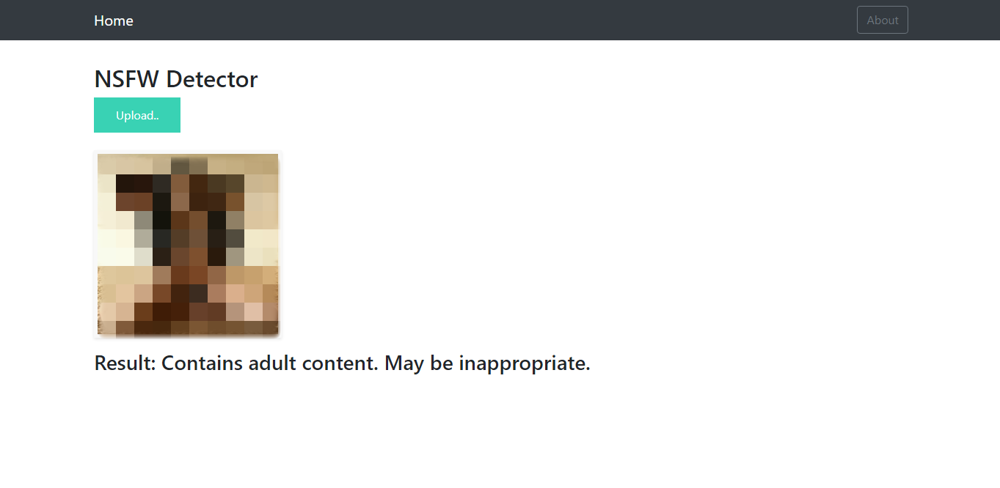
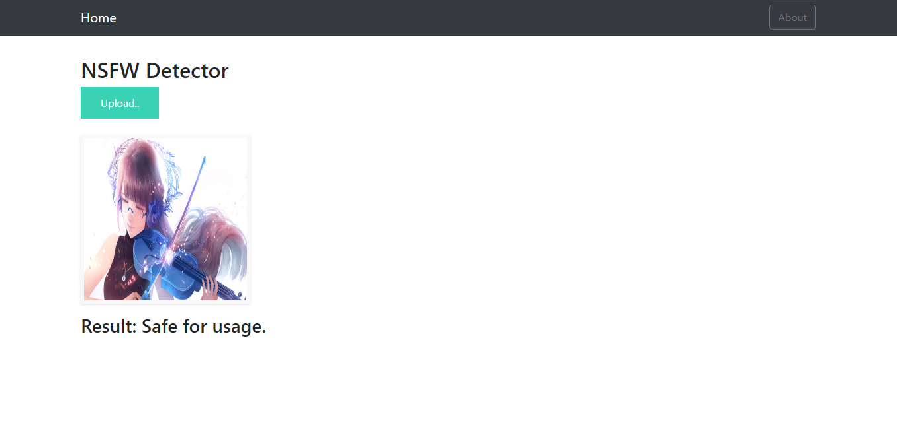

# NSFW detector using Convolution Neural Networks

The given repository builds a decent model for NSFW detection using [NudeNetDataset](https://archive.org/details/NudeNet_classifier_dataset_v1) with the help of [Keras](https://keras.io/). Convolution Neural Networks are used for training the dataset. The model has been trained on a section of the dataset on local machines for the ease of deployment.


--------------------------------



## Dataset


[NudeNetDataset](https://archive.org/details/NudeNet_classifier_dataset_v1) is used for training the model (a section of it). It comprises of three classes - nude (raw), sexy (can be passed further) and safe.


## Pre-trained Models

The Following models were used for extracting features (transfer learning). Also, image size was altered to check the dependencies.
- [VGG16](https://arxiv.org/abs/1409.1556)
- [InceptionV3](https://arxiv.org/abs/1512.00567)

VGG16 is used in the deployed model.


## Training and Testing


### Training

Make sure to have the requirements installed as provided in the `requirements.txt`.

```bash
pip install -r requirements.txt
```

Use the notebook provided in `models/train.ipynb` file in your preferred python execution setup.

The best model outputs will be automatically saved with the code provided in the file itself.

### Testing

The code provided in the [`app.py`](./app.py) file is used for testing the image and rendering the main page.


## Deployment

### Flask

The model had been deployed using [Flask](https://flask.palletsprojects.com/) web Framework. To run the model on localhost run:

```python
python app.py 

```

[Azure Deployment](https://nsfwdetector.azurewebsites.net/). (Decommisoned)
### Usage

After spinning the server up online, just upload your image to get the predicted result.

-------------------------------------------------